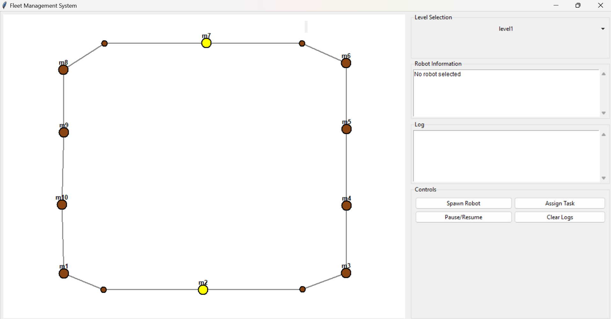
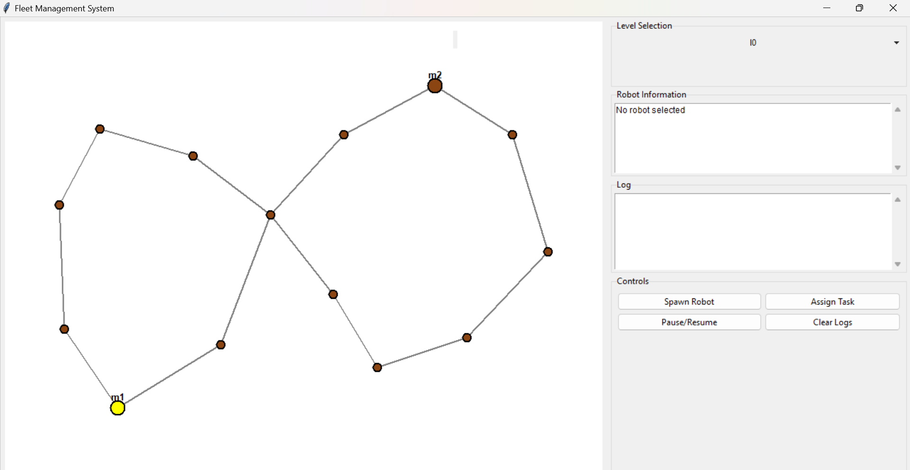
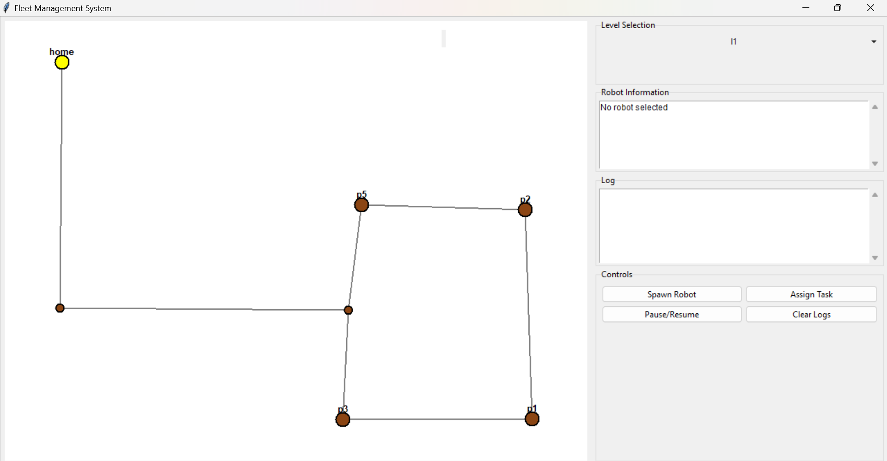
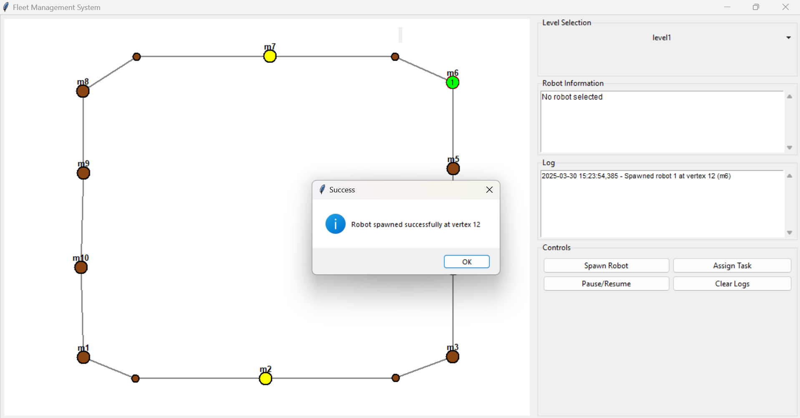
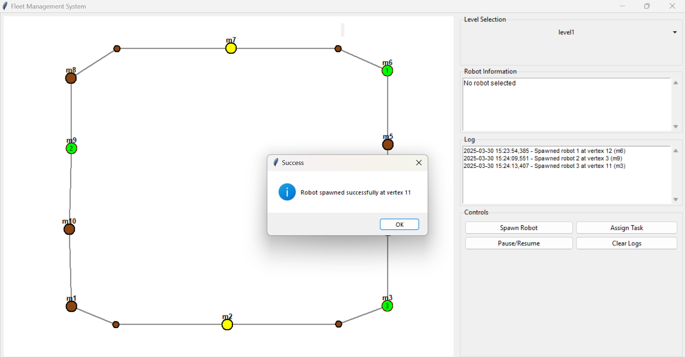
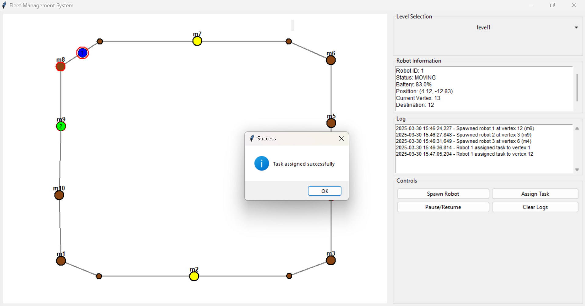
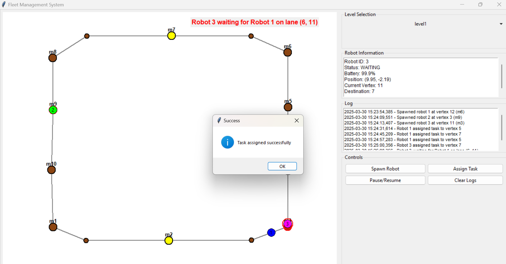
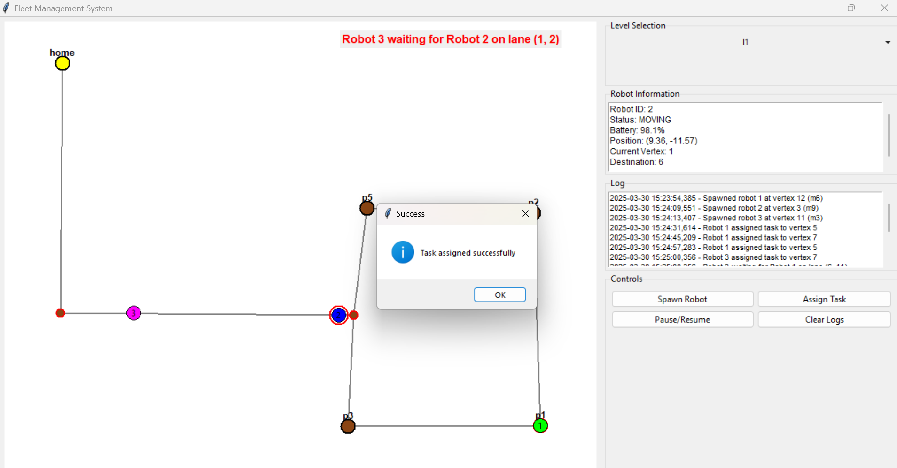

# Robot Fleet Management System 🤖🚀

A sophisticated **GUI-based fleet management system** for autonomous robots with navigation, task assignment, and real-time conflict resolution. Perfect for managing multiple robots in a shared environment!


## 🌟 Key Features

- **🗺️ Multi-Level Navigation**
  - Load different building levels
  - Visualize navigation graphs with vertices and lanes
- **🤖 Robot Management**
  - Spawn robots at specific vertices
  - Assign tasks with automatic pathfinding
  - Real-time position updates
- **⚡ Smart Behaviors**
  - Automatic battery management
  - Self-charging when low on power
  - Dynamic rerouting
- **🚦 Traffic Control**
  - Lane conflict detection
  - Priority-based waiting system
  - Visual conflict notifications
- **📊 Monitoring & Logging**
  - Real-time robot status display
  - Comprehensive activity logging
  - Interactive information panels

## 🛠 Tech Stack

| Component               | Technology                         |
|-------------------------|------------------------------------|
| GUI Framework           | Python Tkinter                     |
| Core Logic              | Python 3.9+                        |
| Navigation              | Dijkstra's Algorithm               |
| Data Format             | JSON                               |
| Package Manager         | pip                                |

## 🚀 Quick Start

### Prerequisites
- Python 3.9+
- pip package manager

### Installation & Running

1. **Clone the repository**
    ```bash
    git clone https://github.com/your-username/robot-fleet-system.git
    cd robot-fleet-system
    ```

2. **Install dependencies**
    ```bash
    pip install -r requirements.txt
    ```

3. **Run the application**
    ```bash
    python src/main.py
    ```

## 🎮 User Guide

### 🗺️ Loading Navigation Maps
1. The system automatically loads `nav_graph.json` from the data directory
2. Use the level selector dropdown to switch between different building levels
   
   
   
   
   
### 🤖 Spawning Robots
1. Click on any vertex (brown circle) on the map
2. Click "Spawn Robot" button or press Enter or just by clicking the particular vertex if the vertex is not occupied then the robot is spawned 
3. New robot will appear at selected vertex (green when idle)

     
     
  
### 📌 Assigning Tasks
1. Select a robot by clicking on it (highlighted with red border)
2. Click on destination vertex
3. Click "Assign Task" button or press Enter
4. Robot will turn blue and start moving along calculated path

   
   
### ⚠️ Handling Conflicts
- When robots conflict on lanes:
  - Lower ID robot gets priority
  - Other robot turns magenta and waits
  - System shows red conflict notification

   
   
 
### 🔋 Battery Management
- Robots automatically:
  - Consume battery while moving
  - Reroute to chargers (yellow vertices) when battery < 20%
  - Charge until battery ≥ 95% then return to idle

## 📂 Project Structure


## 🧪 Testing Scenarios

1. **Basic Navigation**  
   - Spawn robot at Vertex A
   - Assign task to Vertex B
   - Verify path is highlighted and robot moves smoothly

2. **Multi-Robot Conflict**  
   - Spawn two robots near each other
   - Assign intersecting paths
   - Verify conflict resolution (one robot waits)

3. **Low Battery Handling**  
   - Spawn robot with low battery setting
   - Verify it automatically routes to nearest charger
   - Confirm charging behavior

## 🐛 Troubleshooting

### 🚨 Navigation Graph Not Loading
- Verify `nav_graph.json` exists in data directory
- Check JSON file for valid format

### 🚨 Robots Not Moving
- Check if animation is paused (toggle with Pause/Resume button)
- Verify robot has valid path (check logs)

### 🚨 Unexpected Behavior
- Check logs in `logs/fleet_logs.txt`
- Verify all robot statuses in information panel
